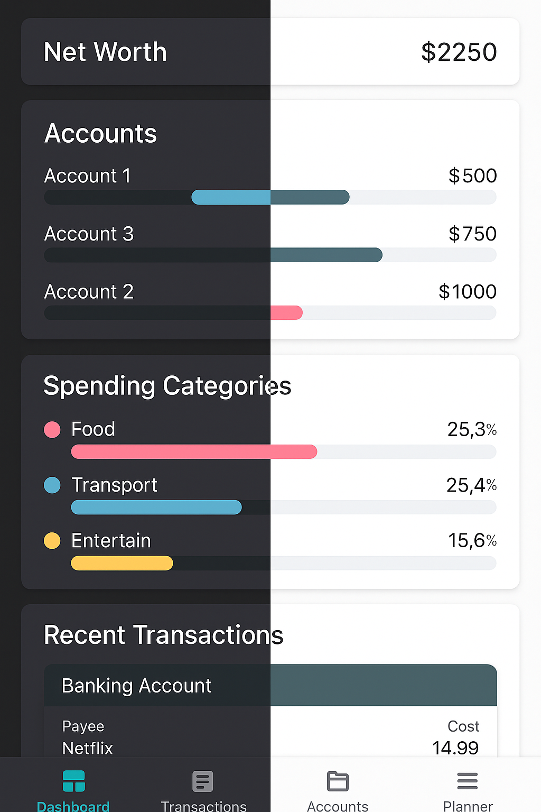

# Flow (Open Source Budgeting App)

This finance tracker is your personal finance companion for effortless money management. Track accounts, monitor spending, and plan budgets while keeping your financial data completely private.

## 💰 COMPLETE FINANCIAL OVERVIEW:
View your net worth, account balances, and spending patterns all in one place. The intuitive dashboard gives you immediate insight into your financial health.

## 📊 POWERFUL CATEGORIZATION:
Organize transactions with a customizable category system. Create parent and sub-categories to track spending exactly how you want and visualize where your money goes.

## 🔍 DETAILED ACCOUNT TRACKING:
Manage multiple accounts in one place - cash, credit cards, and more. Monitor balances and trends over time with easy-to-read graphs.

## 📝 SMART BUDGET PLANNING:
Create custom spending plans based on categories or payees. Set limits and track remaining amounts with visual indicators that show your progress.

## 🔒 PRIVACY & SECURITY BUILT-IN:
Works completely offline with no intrusive permissions. Your financial data stays secure on your device, ensuring peace of mind.

Finance Tracker gives you complete control over your finances while respecting your privacy. Take charge of your financial future today.

## Links:
- 🌐 Learn more: [website.com](https://flowbudgetapp.tiiny.site/)
- 👥 Ask Questions Here!: [github.com/FlowApplication](github.com/FlowBudgetApp/FlowApplication)
